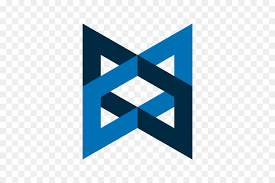
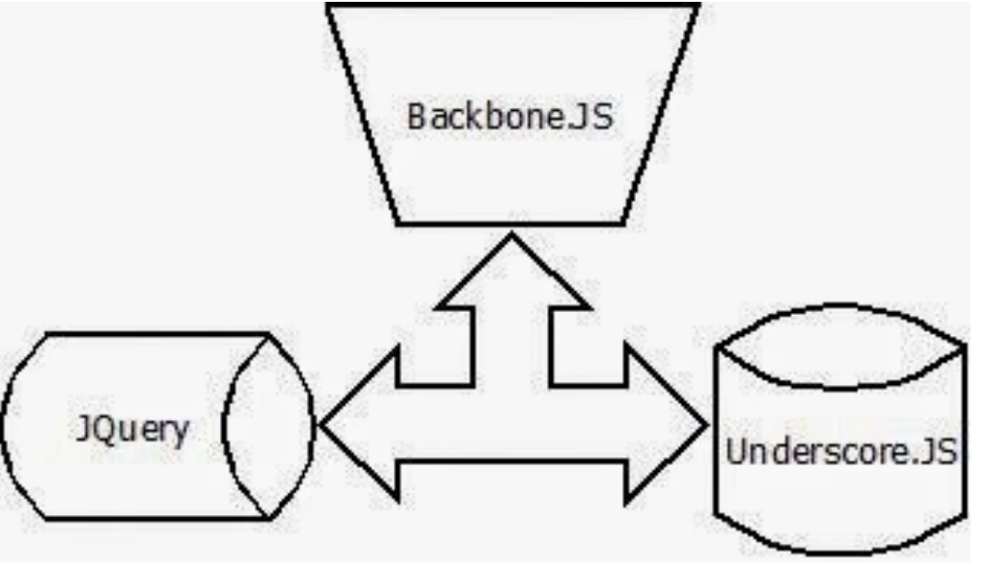
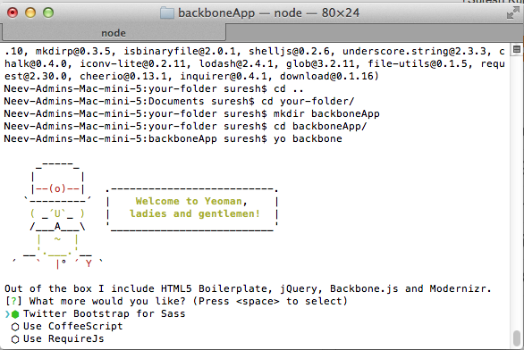
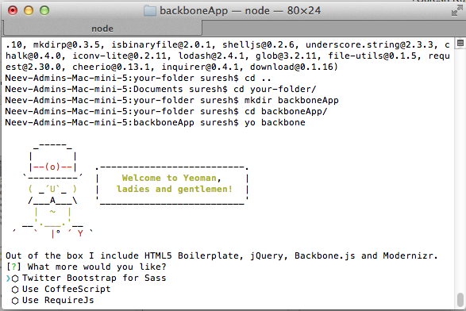
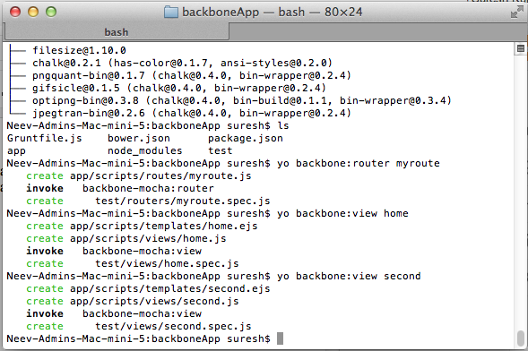

# backbone-js
BackboneJS, MongoDB single page application development.

## Documentation

> “Necessity is the mother of invention“ – Plato

### Dependencies
The dependencies involved in th
- backbone.js
- mongoDB
- yeoman

------------  
### Introduction

Backbone.js is a framework for developing single page applications(SPA), introduced by Jeremy Ashkenas, in the year 2010. He is the author of Coffeescript, which is a programming language that transcompiles to javascript. Anyhow which is irrelevant to the current topic, let’s not get involved in that.

 
Backbone.js is not an independent framework, it depends on underscore.js framework for template and utility functionality, and on jQuery for wiring functionality.  Backbone.js also can be used with the jQuery, mustache.js and combinations like that. Of course, backbone.js is following MVC pattern, MVC can be Model-View-Controller and often it is termed as Model-View-Collection here.

### Let’s get into the action:
 
The tools required for this course.

1. Yeoman scaffolding tool, configured with the generator-backbone
2. Netbeans latest IDE
3. Netbeans connector linked with Google Chrome browser

## Configuration works:

1. To install the Yeoman scaffolding tool, use the following command on the terminal, before that navigate to the directory in   
   which your project wants to be exists via terminal.

   for example cd ~/Documents/your-directory/backboneApp

               $ sudo npm install -g yeoman

   (Note : to install yeoman you have to be first installed node.js, to install node.js click here )
   To configure with the generator-backbone, use the following command on the terminal on the same directory.

               $  sudo npm install -g generator-backbone

   If you’re sure that you’ve installed yeoman successfully, then proceed to the next required configuration.
2. The second configuration task is downloading and installing the latest Netbeans IDE. To download the latest IDE click here.
3. The final task is go to the chrome browser and search for ‘netbeans connector’. Choose option with the title ‘Chrome Web  
   Store – Netbeans Connector’. Click the button ‘ADD TO CHROME’. That’s it the configuration works are finished now.

### What you waiting for? 
 
   After the configuration works done, let’s get into the action. Yes, we’re going to create our first backbone.js application. Now go to the terminal, navigate to the same folder which is mentioned earlier.

    $> mkdir -p ~Documents/your-folder/backboneApp

Note – I deliberately named the folder name as backboneApp, since this name is going to be app name. If you want use a different app name, change the folder name as you want instead backboneApp.

    $> cd ~/Documents/your-folder/backboneApp

Now, use the following command to build the backbone application in the same terminal. The following command is the yeoman (yo) command for building the temporary structure of backbone application.

    $> yo backbone

In a moment, you’ll get this screen.

This dialogue screen ask you to select the libraries you want. Please unselect all by pressing space in the corresponding positions. Because, we’re not going to use those three options for now. After unselecting all the option your screen might look like below.

Now press enter. After the installation use the following command to see the newly added folders in the backboneApp folder.

    $> ls

  You should be able to see some new folders and files added into your empty folder backboneApp. I hope now you’re able to understand the use of yeoman. Yeoman provides a structure for the frameworks like backbone and stuff like that.
               
   Now, start the Netbeans IDE and choose the icon new project, from the list of menu choose the ‘HTML5’ option in the left menu and ‘HTML5 Application with Existing Sources’ option in the right menu go next.  In the Site Root option select browse option choose the folder name ( in our example Documents->your-folder->backboneApp->app). Second option is Project name change the project name as you want. This is only for identifying the project inside the Netbeans IDE, no where else it is going to be used. We’re now giving the project name as MyFirstApp, then click finish. See that MyFirstApp project is added into the project explorer of the Netbeans IDE. Now select the MyFirstApp project from the project explorer, then click the play/run icon (a green button top of the Netbeans IDE). In a moment the Google Chrome browser started and loaded with the default index.html page of our project.
   
   This is the use of Netbeans Connector plug-in. You don’t have to re-run the application after every change. Since you installed Netbeans Connector plug-in, after every save from the Netbeans IDE, your chrome browser with the corresponding project gets refreshed every-time.

  Now Go to the index.html folder clean the commented lines, as it doesn’t throw an error. Remove all div tags but do remember keep all the script tags.

  create a new div tag and with the id ‘contentHolder’ inside the body tag as follows.

    <body>
    //This is the place where our page contents are replaced according to the change.
    </body>
          
   and leave the div tag empty as shown above.

   Next, go to the Netbeans IDE choose the folder SiteRoot -> scripts. There, select the main.js file.  you must see the main.js file contents as below.
   
    /*global backboneApp, $*/
    window.backboneApp = {
        Models: {},
        Collections: {},
        Views: {},
        Routers: {},
        init: function () {
                use strict’;
                console.log(‘Hello from Backbone!’);
         }
      };

      $(document).ready(function () {
      ‘use strict’;
         backboneApp.init();
       });
      

           
   Please note that, window.backboneApp is a window variable which has the scope throughout the application. And moreover the variable name ‘backboneApp’ is the folder name chosen by ourself. And the Models:{}, Collections:{}, Views:{}, Routers{} is represents the internal structure of the variable backboneApp. Apart from that below the 4 line snippet represents a function will triggered at the time of app gets ready.

    $(document).ready(function () {
     ‘use strict’;
     backboneApp.init();
    });

   Now add the following line inside the above snippet.

    Backbone.history.start();
   now the ready function would look like this….

    $(document).ready(function () {
     ‘use strict’;
     backboneApp.init();
     Backbone.history.start();
    });

   The Backbone.history.start(); statement is to start observing the history of the browser. If there is any change in the address bar, It routes to accordingly ( In more detail we would be learning in routers).

   Next, we’re going to add a router for our application. So, use the following yo command in the terminal

    $> yo backbone:router myroute

   i.e, create a ‘myroute’ router inside our backbone application.
         Please observe that a new folder (routes) added inside scripts. In the new folder routes, you could see the file myroute.js which we added. Select the myroute.js file inside Netbeans IDE, and add the following lines.

            //1
            routes: {
                “home” : “goToHome”,
                “second” : “goToSecond”
            },
            //2
            initialize: function()
            {
                this.$content = $(“#contentHolder”);
            },
            //3
            goToHome: function()
            {
                this.homeView = new backboneApp.Views.HomeView();
                this.homeView.render();
                this.$content.html(this.homeView.el);
            },
            //4
            goToSecond: function()
            {
                this.secondView = new backboneApp.Views.SecondView();
                this.secondView.render();
                this.$content.html(this.secondView.el);
            }

   Add the above lines inside the Backbone.Router.extend({ }); function in myroute.js
   
   Let’s now see the functions mentioned above.

   This is routes function which is in-built function with Router module, in which once the Backbone.history.start(); detects any change, this function gets executed. For example if the change is “home” (i.e., the “home” string is appended with the url) then it calls the corresponding view inside the method goToHome. In other hand if the change is “second” then it calls the method goToSecond. Thus the routing mechanism works.
   
   'initialize'  is the function used to set the content pointer, in our example we’ve set the content pointer to the div tag(id:”contentHolder”). So whatever html content fed inside the content pointer would be fed up in the div tag has the id- contentHolder. This is something very programmatic isn’t it?
   
   and 4. are the respective methods which loads the corresponding view’s html assets and renders accordingly. this.homeView.el in this statement el is a default property representing the elements. You’re adding the elements of the homeView to the index.html’s div-tag(id:contentHolder)’s children (indirectly through this.$content.html).

   Now, we are about to have two views named home and second. In which we’re going to load different html tags, in order to prove that this single page application loads different html partials inside the same single page(index.html).

   Now the view part, please use the following yo command,

      $> yo backbone:view home
      $> yo backbone:view second

   Please note that, now two new folder inside scripts added as templates and views. The templates folder contains the UI related stuff required for the view. But in views folder background functionality that are required for the UI are exists. Now, inside templates two new files added as home.ejs and second.ejs. To ensure so far, please look at the screen shot below.
              

   Next a small adjustment you have to made, which is to increase our readability. change file names home.ejs and second.ejs as home.html and second.html. This is because the .ejs extension behaves just like .txt document. There is no alignment/ highlight required, which causes poor readability. So if you change it to .html extension, the tags are aligned properly in Netbeans IDE, and the special strings are highlighted so readability is high in this format.

   Now select the home.html replace string 
Your content here.
 by the below code.

   This is home view, from the backbone application demonstration.
   To go next just click here [Go Second](https://sureshdurairaj.wordpress.com/2016/03/17/an-introduction-to-backbone-js/#second)
          

   Please, note that I’ve used bootstrap classes to highlight the html with the bootstrap grid rendition. You can use without those classes also, if you’re not familiar with bootstrap.css. And in the anchor tag i used href=”#second”. Please find that # is prefixed with the url, which is really unusual isn’t it?. By prefixing # in the href would result that, the new url suffixed with the string in the href. For example here I used href=”#second” this results me if my url is http://www.welcome-home.com/index.html then the anchored new url would be like http://www.welcome-home.com/index.html/second. So, in a nutshell the index.html still be there, only the contents are changing according to the url suffixes.

   Next, select the second.html replace string
   
    
Your content here.
 
    
   by the below code.
   This is second view from the backbone.js demonstration
   goBack

   Next, select home.js file remove the line  template: JST[‘app/scripts/templates/home.ejs’];  and add the following lines.

    render: function(){
      var that = this;
      $.get(“scripts/templates/home.html”, function(data){
        that.$el.html(_.template(data));
      });
    }

   render is the function which is defined by user to fetch the corresponding template and add it to the variable’s element property (ie., this.$el.html) . this.$el.html represents the current instance(home view’s) element variable. Here we used the jquery function $.get to fetch the template from the url “scripts/templates/home.html” and the resulting template did run and interpreted by the underscore’s utility function template(). And the resultant/interpreted template is added to the home view’s instance element variable as a html. Here, we made small thing, the ‘this’ variable is assigned to the variable ‘that’. So during the callback this’s scope enabled through that, since we assigned to it.

   Next, select the second.js file from the views folder under scripts. Again remove the line template: JST[‘app/scripts/templates/second.ejs’]; and add the following lines.

    events:{
      “click #goBack” : “goToHome”
    },render: function(){
      var that =this;
      $.get(“scripts/templates/second.html”, function(data){
      that.$el.html( _.template(data));
      });
    },goToHome: function() {
      window.history.back();
    }

   This is same like the previous home.js, except the new function events. The events function is to observe the delegate events that happens inside the second view. In our example, we used “click #goBack” : “goToHome”, which represents on click of element have id:goBack, the function goToHome get called.  And inside the goToHome function we’re just feeding the previous entry from the browser history. Now click the run button from Netbeans IDE.

   “Alas, I didn’t see anything new”.
   
   Now follow the below steps…..

   Please make sure that, your script reference in the index.html are inside the body or below the body, but not out side the html tag.                                                                                   ie., http://scripts/main.js are inside the html tag, not outside the html tag. In using yo command, sometimes the references are put outside of the html tag in index.html file.
   
   One of the very important issue is that, we do not instantiate/simulate the router module. We commit the same mistake in our example, so now add the following line, in the myroute.js file’s second last line.

    backboneApp.Routers.myroute = new backboneApp.Routers.MyrouteRouter();
    
   Here, we just instantiated the Router class/method with a new variable.
   That’s it. Now click the run icon in the Netbeans IDE. I hope, that now you’re able to see the home view content and second view content by navigating forth and back using the respective buttons inside the html.  Sounds very glad? So, this is the fundamental way of building the backbone applications with the help of yeoman tool.

   Let’s add some spicy stuff on top of our backbone feast. Now we’re going to display a dynamic list on the home view. For that, use the following yo commands to create model/collection.

    $> yo backbone:model mymodel
    $> yo backbone:collection mycollection

   Please note that, inside scripts there are two new folders added named models and collections. Inside each a new file is added with the name mymodel.js and mycollection.js.

   Inside the mymodel.js in the second last line add the below line

    backboneApp.Models.mymodel = new backboneApp.Models.MymodelModel({“name”:”Suresh Kumar”});

   Please, note that we’re not going to use any of the function inside the
backboneApp.Models.MymodelModel = Backbone.Model.extend({   }); Since they’ll used in server side communication, we’re not going touch it. Outside of this method only the above mentioned instantiation to be written.

   Next, inside mycollection.js, do the same kind of instantiation with the following line.

    backboneApp.Collections.myCollection = new backboneApp.Collections.MycollectionCollection(backboneApp.Models.mymodel);

   And please note that,  inside the
   
    backboneApp.Collections.MycollectionCollection = Backbone.Collection.extend({ }); 
           
   the attribute model is written as

    model: backboneApp.Models.MycollectionModel

   replace this with the below line.

    model: backboneApp.Models.MymodelModel

   Now let’s understand what is model and collection. Model is a single instance of a data, which is used to communicate with the server during any course of action performed on a model like post, put, delete, get. Whereas, Collection is a group of data, where each instance is simulated by a particular model. That’s why inside the collection, an attribute ‘model’ which saying that which model is simulated with this collection. In a nutshell, model is record in table where in record you can have multiple attributes like firstName, lastName, age,…. But altogether, a model considered as a single instance of a table/collection. Of course the table is similar to the collection. Same kind of attributes only inserted inside a table that is called simulating a collection with a particular model. A model can be used by multiple collections. But a collection should use a single model to play with data.

   With that classification of model and collection, now we’re going to change something in the view as well. Go to home.html inside templates folder. Replace it’s contents as follows….

   This is home view, from the backbone application demonstration.
   
   To go next just click here [Go Second](https://sureshdurairaj.wordpress.com/2016/03/17/an-introduction-to-backbone-js/#second)
   
   Add
   
    

   In this modified snippet, I used underscore+html together in order to render a list from a collection.
Look at the underscore statement (enclosed by % tag), <%_.each(backboneApp.Collections.myCollection.toJSON(), function(data){ %> this will get the collection-mycollection values and iterate it in a list. <% = data.name %> This statement displays attribute “name” value in a list on each iteration. Simple!!!  isn’t it?  If your answer is no, then please do understand that the underscore snippets have the similarity with the php/jsp codes. If you’re familiar with simple php codes, then you’re already well versed with the above explanation.

   Next, make a small modification in the home.js file inside the views folder as follows…

            //2
            events:{
              “click #add” : “addNewName”
            },
            
            //1
            initialize: function(){
            backboneApp.Collections.myCollection.on(“add”,this.render,this);
            },
            render: function(){
                var that = this;
                $.get(“scripts/templates/home.html”, function(data){
                    console.log(“_.template(data)”+_.template(data));
                   that.$el.html(_.template(data));
                });
            },
            
            //3
            addNewName: function(){
                var temp = {};
                temp.name = $(“#name”).val();
                var tempModel = new backboneApp.Models.MymodelModel(temp);
                backboneApp.Collections.myCollection.add(tempModel);
            }

   Please note that, render is the function was already there, now 3 functions added newly. Let’s start with one by one.

   initialize is the function provided by backbone itself. In which we can do something which are done only on the launch of the application. i.e., only once in the during the application life time. initialize also be used to exception handling and event handling as well. In our example to make our page dynamic I’m writing the below line  backboneApp.Collections.myCollection.on(“add”,this.render,this); This means that if myCollection gets added with some data, then the page is re-rendered with the newly added data. ie., The add event is captured and the corresponding action is calling the render method again. By the time the myCollection is reiterated so that the new data also be rendered.
            
   events: As mentioned previously this method is used to capture the delegate events, here in this method, we’re capturing the click event on the DOM element with id:add, followed by we’re calling a function named “addNewName”.
            
   addNewName: This method gets the value of DOM element with id:name, and put it in object temp.name; Next, we’re simulating the object temp with the model backboneApp.Models.MymodelModel. So that, this can be added inside the collection. backboneApp.Collections.myCollection.add(tempModel); This line adds the new instance into the table myCollection. As soon as the add is triggered, the event handling over collection/model inside initialize captures this event and performs the re-render operation as mentioned in the first point. Thus the dynamic rendition achieved inside backbone.js. The render method of the current view can be called at any number of times.

   Now click the run icon inside the Netbeans IDE, and enter names in the text box, click add and see that, your strings are get listed one by one after pressing the add button. That’s it, now you could understand the fundamentals of the Backbone.js.
   Inside the model we intentionally left some attributes/functions, since they’re used to communicate with the server.
